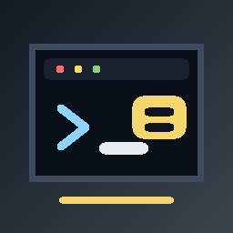

# fpasoterm



Cross-platform terminal app built with xterm.js and node-pty.

日本語の概要は [日本語](#日本語) を参照してください。

- The desktop runtime provides the application shell and Chromium text input/composition behavior.
- xterm.js renders the terminal in the renderer process.
- node-pty owns the real shell/PTY in the main process.

Japanese IME composition and keyboard layout switching are handled by Chromium/xterm.js on platforms where Chromium dispatches the input events. fpasoterm does not intercept `かな` / `英数` key presses.

On macOS, Chromium does not dispatch events for the JIS `かな` / `英数` hardware keys, so fpasoterm cannot bind those keys directly in the current Chromium-based desktop runtime.

Set `FPASOTERM_DEBUG_KEYS=1` to print runtime key names to stderr and show the latest key/composition event in the window while testing Japanese keyboard keys.

Debug logs are also written to `diagnostics/fpasoterm-debug.log`. The debug panel has a Copy button because xterm.js can capture normal terminal copy shortcuts.

On Linux, fpasoterm uses `--ozone-platform=x11` by default so Chromium Ozone is initialized before the app loads. You can override it:

```sh
FPASOTERM_OZONE_PLATFORM=wayland ./scripts/run
```

Use `./scripts/run` on Linux. It passes the ozone switch before the app path; setting the switch inside the main process is too late for Ozone initialization.

Wayland IME and GPU disabling are opt-in diagnostics:

```sh
FPASOTERM_ENABLE_WAYLAND_IME=1 ./scripts/run
FPASOTERM_DISABLE_GPU=1 ./scripts/run
```

Additional Chromium switches can be tested without code changes:

```sh
FPASOTERM_GTK_VERSION=3 ./scripts/run
FPASOTERM_GTK_VERSION=4 ./scripts/run
FPASOTERM_ENABLE_FEATURES=UseOzonePlatform ./scripts/run
```

## Requirements

Detailed installation instructions are in [INSTALL.md](INSTALL.md).

For local ChromeOS Linux development:

```sh
sudo apt install build-essential python3 make g++
```

Node.js is managed by mise in this workspace. You can also use a system Node.js installation.

## Run

```sh
npm install
./scripts/run
```

With mise:

```sh
mise exec node -- npm install
mise exec node -- npm start
```

To install a local command and launcher entry for this checkout:

```sh
npm run install:desktop
fpasoterm
```

The command is installed to `~/.local/bin/fpasoterm` by default. Set `XDG_BIN_HOME` to choose a different command directory.

To update the local command, launcher entry, and icons after pulling a newer checkout:

```sh
npm run update:desktop
```

To cleanly remove the local command, launcher entry, and installed launcher icons:

```sh
npm run uninstall:desktop
```

## Command-line binary

Install from the npm registry:

```sh
npm install -g fpasoterm
fpasoterm
```

The npm package name and command are both `fpasoterm`.

During development, link the package to expose a `fpasoterm` command:

```sh
npm link
fpasoterm
```

Alternatively:

```sh
npm install -g .
fpasoterm
```

The binary passes `--ozone-platform=x11` before the app path on Linux.

When the shell exits, for example by running `exit`, fpasoterm closes the application window.

## Command-line Options

Normal launches detach from the console and return the shell prompt immediately:

```sh
fpasoterm
```

Show available options:

```sh
fpasoterm --help
```

Useful one-shot overrides:

```sh
fpasoterm --config ~/.config/fpasoterm/User/work.toml
fpasoterm --size 1200x760
fpasoterm --width 1200 --height 760
```

Inspect the resolved settings and plugin load status without launching:

```sh
fpasoterm --show-config
fpasoterm --config ~/.config/fpasoterm/User/work.toml --show-config
```

Enable or disable plugins in `config.toml`:

```sh
fpasoterm --enable-plugin hello.ts,theme.ts
fpasoterm --disable-plugin hello.ts,theme.ts
```

For debugging, keep the app attached to the current console:

```sh
fpasoterm --foreground --console-diagnostics
```

## Configuration and Plugins

fpasoterm reads user configuration from:

```text
~/.config/fpasoterm/User/config.toml
```

On first launch, fpasoterm writes an example file to:

```text
~/.config/fpasoterm/User/config.toml.example
```

Example:

```toml
[terminal]
fontSize = 15
fontFamily = "Noto Sans Mono CJK JP, monospace"

[terminal.theme]
background = "#101317"
foreground = "#e8edf2"

[ime]
duplicateGuard = true
duplicateWindowMs = 800
repeatedTextWindowMs = 140

[plugins]
enabled = ["plugins/example.ts"]
```

Plugins must live under `~/.config/fpasoterm/User/plugins/`. JavaScript (`.js`) and TypeScript (`.ts`) plugins are supported. TypeScript plugins are transpiled into `~/.config/fpasoterm/User/cache/plugins/` at launch.

Minimal TypeScript plugin:

```ts
/// <reference path="/path/to/fpasoterm/docs/fpasoterm-plugin.d.ts" />

const api = window.fpasotermPluginApi;
api.log('example plugin loaded');
api.terminal.options.cursorBlink = true;
```

The IME duplicate guard can be adjusted from `config.toml`. If a specific environment still produces duplicate text, increase `ime.duplicateWindowMs` or `ime.repeatedTextWindowMs` slightly.

The full default configuration and plugin setup are documented in [Configuration](docs/config.en.md). Sample configs are available in [examples/config](examples/config), and sample TypeScript plugins are available in [examples/plugins](examples/plugins).

## Icon

The project icon is a PNG asset:

```text
extra/logo/fpasoterm.png
```

The application window uses this PNG directly. The desktop entry uses `Icon=fpasoterm`; ChromeOS/Linux launchers resolve that name through the hicolor icon theme files under:

```text
extra/linux/icons/hicolor/
```

On macOS, the app also sets the Dock icon to the same PNG at launch so the generic app icon is not shown.

When packaging a macOS `.app` bundle, use the generated icon at:

```text
extra/macos/fpasoterm.icns
```

On Windows, the app window uses the generated icon at:

```text
extra/windows/fpasoterm.ico
```

To replace the icon, update `extra/logo/fpasoterm.png`, regenerate the launcher sizes, and reinstall the desktop entry:

```sh
npm run generate:icons
npm run update:desktop
```

For Android-native packaging, use the same PNG as the source asset for the Android adaptive icon pipeline.

## License

MIT. See [LICENSE](LICENSE).

## Contributing

See [CONTRIBUTING.md](CONTRIBUTING.md). Release history is tracked in [CHANGELOG.md](CHANGELOG.md).

## Project Name

The jj bookmark `main` points at an empty initial commit. The app implementation lives in the child change named `Initial fpasoterm terminal app`.

## jj Repository Initialization

```sh
cd fpasoterm
./scripts/init-jj-empty-main
```

The script creates an empty `main` branch first, then records the initial project files on top of it.

## Checks

```sh
npm run check
npm run scan:secrets
desktop-file-validate extra/linux/io.github.oyoguhito.fpasoterm.desktop
npm run audit:prod
```

GitHub Actions runs the same check set on pushes and pull requests.

## Documentation

- [Specification](docs/spec.en.md)
- [Configuration](docs/config.en.md)
- [Release checklist](docs/release-checklist.en.md)
- [仕様](docs/spec.ja.md)
- [設定](docs/config.ja.md)
- [リリースチェックリスト](docs/release-checklist.ja.md)

## 日本語

fpasoterm は xterm.js、node-pty を使った Terminal アプリです。ChromeOS Linux での日本語入力を重視しつつ、将来的に他 OS へ展開しやすい構成にしています。

fpasoterm は `かな` / `英数` キーを横取りしません。日本語入力の切替と composition は Chromium と OS 側に任せます。

Linux では Chromium Ozone の初期化に間に合うよう、app path より前に以下の switch を渡します。

```sh
--ozone-platform=x11
```

この値は `FPASOTERM_OZONE_PLATFORM` で上書きできます。

起動:

```sh
npm install
./scripts/run
```

shell で `exit` を実行すると fpasoterm のウィンドウも閉じます。

## コマンドラインオプション

通常起動ではコンソールから切り離して起動し、すぐに shell prompt が戻ります。

```sh
fpasoterm
```

オプション一覧:

```sh
fpasoterm --help
```

一時的な設定上書き:

```sh
fpasoterm --config ~/.config/fpasoterm/User/work.toml
fpasoterm --size 1200x760
fpasoterm --width 1200 --height 760
```

起動せずに解決済み設定と plugin 読み込み状況を確認:

```sh
fpasoterm --show-config
fpasoterm --config ~/.config/fpasoterm/User/work.toml --show-config
```

`config.toml` の plugin を有効化・無効化:

```sh
fpasoterm --enable-plugin hello.ts,theme.ts
fpasoterm --disable-plugin hello.ts,theme.ts
```

デバッグ時にコンソールへ接続したまま起動する場合:

```sh
fpasoterm --foreground --console-diagnostics
```

## 設定とプラグイン

fpasoterm は以下の設定を読み込みます。

```text
~/.config/fpasoterm/User/config.toml
```

初回起動時には以下にサンプルを書き出します。

```text
~/.config/fpasoterm/User/config.toml.example
```

例:

```toml
[terminal]
fontSize = 15
fontFamily = "Noto Sans Mono CJK JP, monospace"

[ime]
duplicateGuard = true
duplicateWindowMs = 800
repeatedTextWindowMs = 140

[plugins]
enabled = ["plugins/example.ts"]
```

プラグインは `~/.config/fpasoterm/User/plugins/` 配下に置きます。JavaScript (`.js`) と TypeScript (`.ts`) に対応しています。TypeScript plugin は起動時に `~/.config/fpasoterm/User/cache/plugins/` へ変換されます。

最小の TypeScript plugin:

```ts
/// <reference path="/path/to/fpasoterm/docs/fpasoterm-plugin.d.ts" />

const api = window.fpasotermPluginApi;
api.log('example plugin loaded');
api.terminal.options.cursorBlink = true;
```

二重入力が残る環境では、`config.toml` の `ime.duplicateWindowMs` または `ime.repeatedTextWindowMs` を少し大きくしてください。

全デフォルト設定と plugin 設定は [設定](docs/config.ja.md) にまとめています。設定サンプルは [examples/config](examples/config)、TypeScript plugin のサンプルは [examples/plugins](examples/plugins) にあります。

npm registry から global install する場合:

```sh
npm install -g fpasoterm
fpasoterm
```

開発中に link する場合:

```sh
npm link
fpasoterm
```

または:

```sh
npm install -g .
fpasoterm
```

診断:

```sh
FPASOTERM_DEBUG_KEYS=1 ./scripts/run
cat diagnostics/fpasoterm-debug.log
```

アイコンを変更する場合は `extra/logo/fpasoterm.png` を差し替え、以下を実行します。

```sh
npm run generate:icons
npm run install:desktop
```

ChromeOS Linux launcher は `extra/linux/icons/hicolor/` に生成されるサイズ別 PNG を使います。Android native package を作る場合は、この PNG を adaptive icon の元画像として使います。
