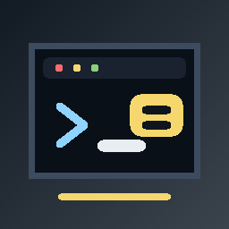

# fpasoterm



Cross-platform terminal app built with Tauri, xterm.js, and a Rust PTY bridge.

fpasoterm is intended to be used with terminal multiplexers such as screen / tmux / byobu / herdr. It focuses on a single terminal surface and does not manage split panes. Multiple application windows can be tiled from the titlebar.

Kitty Graphics Protocol, SIXEL, and iTerm inline images are currently unsupported because image streams can freeze the Tauri/WebKitGTK renderer. `Ctrl+Shift+B` opens Broadcast Input, which selects local fpasoterm windows before sending one command; a trusted sync folder can optionally deliver the same short-lived command to every already-running instance on another machine. See [Configuration](docs/config.en.md) and [Sync Folder](docs/sync.en.md).

Japanese documentation: [README.ja.md](README.ja.md). Installation instructions are available in [English](INSTALL.md) and [Japanese](INSTALL.ja.md).

- Tauri provides the application shell through the platform webview.
- xterm.js renders the terminal in the renderer process.
- Rust and portable-pty own the real shell/PTY in the backend process.

Japanese IME composition and keyboard layout switching are handled by the OS webview and xterm.js. fpasoterm does not intercept `かな` / `英数` key presses.

Set `FPASOTERM_DEBUG_KEYS=1` to print runtime key names to stderr and show the latest key/composition event in the window while testing Japanese keyboard keys.

Debug logs are also written to `~/.config/fpasoterm/User/logs/fpasoterm-debug.log`. The debug panel has a Copy button because xterm.js can capture normal terminal copy shortcuts.

On Linux, Tauri uses WebKitGTK. If ChromeOS/Baguette shows black, white, or flickering surfaces while testing transparent windows, disable the DMA-BUF renderer for that launch:

```sh
fpasoterm --disable-dmabuf
```

## Requirements

Detailed installation instructions are in [INSTALL.md](INSTALL.md).

For local ChromeOS Linux development:

```sh
sudo apt install build-essential curl libgtk-3-dev libwebkit2gtk-4.1-dev libayatana-appindicator3-dev librsvg2-dev
```

Node.js and Rust are managed by mise in this workspace. You can also use system installations.

## Run

```sh
npm install
./scripts/run
```

For quick source-checking without rebuilding release bundles:

```sh
./bin/fpasoterm --dev
```

Use this after editing renderer or Tauri source. It ignores any stale `src-tauri/target/release/fpasoterm` binary.
Add `--foreground --console-diagnostics` only when you need logs in the current console.

With mise:

```sh
mise exec node -- npm install
mise exec node -- npm start
```

To install a local command and launcher entry for this checkout:

```sh
npm run install:desktop
fpasoterm
```

The command is installed to `~/.local/bin/fpasoterm` by default. Set `XDG_BIN_HOME` to choose a different command directory.

To update the local command, launcher entry, and icons after pulling a newer checkout:

```sh
npm run update:desktop
```

To update an npm-installed fpasoterm package from the terminal:

```sh
fpasoterm --self-update
```

For a source checkout, update the checkout with your normal git or jj workflow,
then refresh desktop integration:

```sh
fpasoterm --update-desktop
```

To cleanly remove the local command, launcher entry, installed launcher icons, user config, runtime cache, and Tauri/WebKit app data:

```sh
npm run uninstall:desktop
```

On Windows, the same command removes fpasoterm-specific directories from the
current user's `Path` if they were added during local testing. It does not remove
shared npm directories from `Path`.

## Command-line binary

Install from the npm registry:

```sh
npm install -g fpasoterm
fpasoterm
```

The npm package name and command are both `fpasoterm`.
Check the installed version without opening a window:

```sh
fpasoterm --version
fpasoterm -v
```

On Windows, run the same check against the installed executable after replacing an older installer build. If the old UI is still visible but `fpasoterm --version` prints the older version, the previous executable is still the one being launched from `Path` or the Start menu.

During development, link the package to expose a `fpasoterm` command:

```sh
npm link
fpasoterm
```

Alternatively:

```sh
npm install -g .
fpasoterm
```

When the shell exits, for example by running `exit`, fpasoterm closes the application window.

## Command-line Options

Normal launches using a cached runtime detach from the console and return the
shell prompt immediately:

```sh
fpasoterm
```

When a first source or npm-package launch needs a local Cargo build, the CLI
stays attached and prints phase 1/3 preparation, phase 2/3 compiler progress,
and phase 3/3 native window startup. Cargo errors are shown in that terminal;
the prompt returns after the window process is started. Timing and compiler
output are also appended to `~/.cache/fpasoterm/launcher.log` on Linux/macOS,
or `%LOCALAPPDATA%\\fpasoterm\\launcher.log` on Windows. Use
`--foreground --console-diagnostics` only when the caller must also wait for
the desktop process to exit.

Show available options:

```sh
fpasoterm --help
```

List running fpasoterm windows without opening another window:

```sh
fpasoterm --list
fpasoterm -l
```

Each line contains the process/session ID, displayed title, and startup time.

Close running windows by PID, exact displayed title, or the reserved `all` target:

```sh
fpasoterm --close 12345
fpasoterm -q review-shell
fpasoterm --close all
```

Useful one-shot overrides:

```sh
fpasoterm --config ~/.config/fpasoterm/User/work.toml
fpasoterm --size 1200x760
fpasoterm --width 1200 --height 760
fpasoterm --shell pwsh.exe
fpasoterm --command "tmux attach -t work"
fpasoterm --title work --titlebar-color '#2e7d32'
fpasoterm --reset-config
fpasoterm --reset-window-state
```

On Windows, fpasoterm uses PowerShell 7 (`pwsh.exe`) by default when it is
available. If it is not on `PATH`, fpasoterm also checks common install paths
such as `C:\Program Files\PowerShell\7\pwsh.exe`, then falls back to the OS
command shell. A full path can always be used with `--shell`.

Windows child shells also receive the fpasoterm executable directory at the
front of `Path`, so commands such as `fpasoterm --help` work inside a
fpasoterm terminal after installation.

macOS child shells receive the application executable directory at the front
of `PATH` as well. Running `fpasoterm` there opens a detached window and returns
the current prompt without waiting for that window to close.

By default, fpasoterm keeps its configured title even if the shell emits its own
title sequence. Use `OSC 777;title=...` for an intentional runtime rename.

Short options are available for common one-shot overrides:

```sh
fpasoterm -t work -b '#2e7d32' -z 1200x760 -s pwsh.exe
fpasoterm -e "tmux attach -t work"
```

The running window can also be renamed from inside the terminal with a POSIX shell:

```sh
printf '\033]0;work\a\r\n'
printf '\033]777;titlebarColor=#2e7d32\a\r\n'
printf '\033]777;opacity=0.65\a\r\n'
printf '\033]777;title=work;titlebarColor=#2e7d32\a\r\n'
```

Windows PowerShell and cmd.exe do not run those `printf` examples as-is. Use the
PowerShell form or the helper scripts below:

```powershell
[Console]::Write("$([char]27)]777;title=work;titlebarColor=#2e7d32$([char]7)`r`n")
```

The runtime config sample can be applied with:

```sh
./examples/apply-runtime-appearance.sh
```

On Windows PowerShell or cmd.exe:

```powershell
.\examples\apply-runtime-appearance.ps1
.\examples\apply-runtime-appearance.bat
```

This sample changes the title to `RUNTIME SAMPLE ACTIVE`, switches the titlebar
to pink, and changes the terminal background and text colors.

To return the running window to the default appearance:

```sh
./examples/apply-default-appearance.sh
```

On Windows PowerShell or cmd.exe:

```powershell
.\examples\apply-default-appearance.ps1
.\examples\apply-default-appearance.bat
```

Or, if you need to specify the path manually:

```sh
config_path="$(pwd)/examples/config/runtime-appearance.toml"
printf '\033]777;config=%s\a\r\n' "$config_path"
```

On Windows PowerShell:

```powershell
$configPath = Resolve-Path .\examples\config\runtime-appearance.toml
[Console]::Write("$([char]27)]777;config=$configPath$([char]7)`r`n")
```

Runtime config application keeps the current shell session running. It applies
live window and terminal appearance settings such as `window.title`,
`window.titlebarColor`, `window.width`, `window.height`, `terminal.fontSize`,
`terminal.lineHeight`, `terminal.fontFamily`, `terminal.backgroundOpacity`, and
`terminal.theme`.
Settings that require a new PTY, such as `terminal.shell`, take effect on the next launch.

Inspect the resolved settings and plugin load status without launching:

```sh
fpasoterm --show-config
fpasoterm --config ~/.config/fpasoterm/User/work.toml --show-config
```

When a packaged `fpasoterm.exe` is launched directly on Windows, `--show-config`
prints the resolved runtime config as JSON. The Node launcher prints TOML and
plugin load details when it is available.

Enable or disable plugins in `config.toml`:

```sh
fpasoterm --enable-plugin hello.ts,theme.ts
fpasoterm --disable-plugin hello.ts,theme.ts
```

Plugin enable/disable commands are handled by the Node launcher. For direct
packaged binary launches, edit `config.toml` manually or use the npm-installed
`fpasoterm` command.

For debugging, keep the app attached to the current console:

```sh
fpasoterm --foreground --console-diagnostics
```

In a source checkout, force a fresh local debug-binary build when you want to confirm current behavior. This uses bundled static frontend assets and does not require a localhost development server. Omit `--foreground` when you want the shell prompt back after launch:

```sh
./bin/fpasoterm --dev
```

For ChromeOS/Baguette WebKitGTK rendering diagnostics:

```sh
fpasoterm --disable-dmabuf
```

## Configuration and Plugins

fpasoterm reads user configuration from:

```text
~/.config/fpasoterm/User/config.toml
```

On launch, fpasoterm writes or refreshes the example file at:

```text
~/.config/fpasoterm/User/config.toml.example
```

The example file is safe to regenerate because fpasoterm does not overwrite `config.toml`.

Example:

```toml
[window]
rememberBounds = true
frame = false
[terminal]
fontSize = 15
lineHeight = 1.12
fontFamily = "Noto Sans Mono CJK JP, monospace"

[terminal.theme]
background = "rgba(16, 19, 23, 0.80)"
foreground = "#e8edf2"

[ime]
duplicateGuard = true
duplicateWindowMs = 800
repeatedTextWindowMs = 140

[plugins]
enabled = ["plugins/example.ts"]
```

Plugins must live under `~/.config/fpasoterm/User/plugins/`. JavaScript (`.js`) and TypeScript (`.ts`) plugins are supported. TypeScript plugins are transpiled into `~/.config/fpasoterm/User/cache/plugins/` at launch. They run in the renderer context, so enable only trusted local files that you have reviewed.

Plugins can read `version`, run post-startup work through `onReady()`, and add
actions to the hamburger menu's `Plugins` section through `registerCommand()`.
Use `fpasoterm --plugin-list` to inspect discovered and enabled plugins, or
`--plugin-enable` / `--plugin-disable` to update the enabled list. Use
`fpasoterm --plugin-info welcome-banner.ts` for a plugin's source, enabled
state, description, and load status. Restart the affected window after an
enable or source change.

Minimal TypeScript plugin:

```ts
/// <reference path="/path/to/fpasoterm/docs/fpasoterm-plugin.d.ts" />

const api = window.fpasotermPluginApi;
api.log('example plugin loaded');
api.terminal.options.cursorBlink = true;
```

The IME duplicate guard can be adjusted from `config.toml`. If a specific environment still produces duplicate text, increase `ime.duplicateWindowMs` or `ime.repeatedTextWindowMs` slightly.

When `window.rememberBounds` is enabled, fpasoterm stores the last window size locally in `~/.config/fpasoterm/User/window-state.json`.

Window appearance and size are resolved in this order: default settings, explicit values in `config.toml`, saved `window-state.json` for size, then one-shot CLI overrides such as `--title`, `--titlebar-color`, and `--size`.

To return to the configured or default size manually, set `window.rememberBounds = false`, or run:

```sh
fpasoterm --reset-window-state
```

To restore every setting and window size to its platform default, run
`fpasoterm --reset-config` or `fpasoterm -R`. The existing file is renamed to
`config.toml.backup-<timestamp>` before a complete new `config.toml` is written.
The saved `window-state.json` is also removed so the default width of 1000 and
height of 680 take effect on the next launch.

The full default configuration is documented in [Configuration](docs/config.en.md). See [Plugins](docs/plugins.en.md) for setup, security guidance, CLI management, and the supported API declaration in [`docs/fpasoterm-plugin.d.ts`](docs/fpasoterm-plugin.d.ts). Sample configs are available in [examples/config](examples/config), and public plugin samples are available in [examples/plugins](examples/plugins).

For maintenance workflows across machines, fpasoterm can share diagnostics and
terminal output logs through a local sync folder such as Google Drive for
desktop. It does not use Google Drive API or OAuth. See [Sync Folder](docs/sync.en.md).
Run `fpasoterm --setup-sync` for an interactive first-time setup.
On Windows source checkouts, run `node .\bin\fpasoterm --setup-sync`.
Terminal output logs can be written from the hamburger menu with `Log Start (^S)` /
`Log Stop (^S)` or `Ctrl+Shift+S`, and inspected with `Log Show (^P)` or `Ctrl+Shift+P`.
`Log Show` displays the active log or the last log closed by `Log Stop`. Point
`logging.directory` at the same synced folder when you want those logs shared.
The log panel includes a search field and `Search` button for selecting and
scrolling to the next matching string in the displayed log. `N` moves to the
next match, `P` moves to the previous match, and `j` / `k` provide the same
navigation when the log text area has focus. Arrow keys remain available for
normal log scrolling.

Current platform limitations are tracked in [Known Issues](docs/known-issues.en.md) / [既知課題](docs/known-issues.ja.md).

## Icon

The project icon is a PNG asset:

```text
extra/logo/fpasoterm.png
```

The desktop entry uses `Icon=io.github.oyoguhito.fpasoterm`; ChromeOS/Linux launchers resolve that name through the hicolor icon theme files under:

```text
extra/linux/icons/hicolor/
```

The installed entry uses `StartupWMClass=fpasoterm` and keeps the GTK
application id disabled so multiple fpasoterm windows can be started from the
CLI or launcher. ChromeOS/Linux launchers still resolve the shelf icon from
`Icon=io.github.oyoguhito.fpasoterm` for the ChromeOS shelf. The installer also writes a legacy
`fpasoterm` icon alias for environments that prefer short icon names.

For unpacked checkout installs, `npm run install:desktop` writes the installed
desktop entry with an absolute `Exec=` path to the local wrapper and no
`TryExec`. The wrapper records the Node.js executable used during installation
and also falls back to common `node` paths. This lets the ChromeOS launcher
start fpasoterm from the icon even when it does not inherit the user's shell
`PATH`.

The GTK application id is disabled so multiple fpasoterm processes can run.
When multiple fpasoterm windows are open, use `Tile (^T)` in the titlebar window
menu, or press `Ctrl+Shift+T`,
to arrange them into a grid on the current monitor. Windows and X11 support
native placement. Wayland compositors may reject application-controlled
positions; the terminal remains usable and the diagnostic panel reports the
placement error.
Use `Close All (^X)` in the same menu, or press `Ctrl+Shift+X`, to close every
running fpasoterm window.

When packaging a macOS `.app` bundle, use the generated icon at:

```text
extra/macos/fpasoterm.icns
```

On Windows, the app window uses the generated icon at:

```text
extra/windows/fpasoterm.ico
```

To replace the icon, update `extra/logo/fpasoterm.png`, regenerate the launcher sizes, and reinstall the desktop entry:

```sh
npm run generate:icons
npm run update:desktop
```

For Android-native packaging, use the same PNG as the source asset for the Android adaptive icon pipeline.

## License

MIT. See [LICENSE](LICENSE).

## Contributing

See [CONTRIBUTING.md](CONTRIBUTING.md). Release history is tracked in [CHANGELOG.md](CHANGELOG.md).

## Project Name

The jj bookmark `main` points at an empty initial commit. The app implementation lives in the child change named `Initial fpasoterm terminal app`.

## jj Repository Initialization

```sh
cd fpasoterm
./scripts/init-jj-empty-main
```

The script creates an empty `main` branch first, then records the initial project files on top of it.

## Checks

```sh
npm run check
npm run scan:secrets
desktop-file-validate extra/linux/io.github.oyoguhito.fpasoterm.desktop
npm run audit:prod
```

GitHub Actions runs the same check set on pushes and pull requests.

## Documentation

- [Specification](docs/spec.en.md)
- [Configuration](docs/config.en.md)
- [Sync Folder](docs/sync.en.md)
- [Pull request review](docs/pr-review.en.md)
- [Release checklist](docs/release-checklist.en.md)
