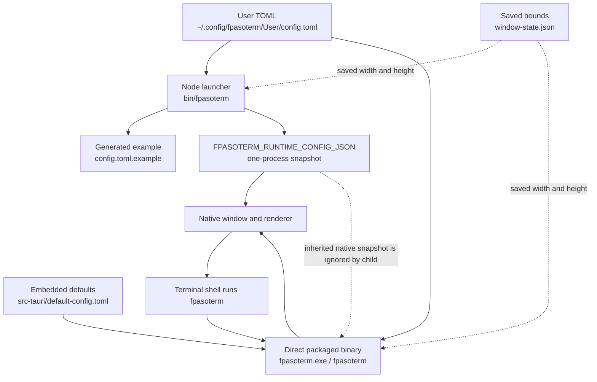

# fpasoterm Configuration

fpasoterm reads user-editable settings from:

```text
~/.config/fpasoterm/User/config.toml
```

On Windows, `~` is the current user's profile directory, so the default path is
`%USERPROFILE%\.config\fpasoterm\User\config.toml`.

On launch, fpasoterm writes or refreshes the full default example at:

```text
~/.config/fpasoterm/User/config.toml.example
```

Copy the example to `config.toml` and edit only the values you want to change. Existing `config.toml` files are not overwritten. If `config.toml.example` is missing or outdated, fpasoterm regenerates it on the next launch.

Use another config file for one launch:

```sh
fpasoterm --config ~/.config/fpasoterm/User/work.toml
fpasoterm -c ~/.config/fpasoterm/User/work.toml
```

Open `Help` from the window menu to see the absolute path of the configuration
file currently used by that window. This also reflects a runtime config file
applied through `OSC 777;config=...`.

## Applying changes

fpasoterm reads `config.toml` when each window process starts. The launcher
passes that resolved configuration to the native process as an in-memory JSON
snapshot; it is not a file cache and an already-running window does not watch
for TOML changes. Close and reopen the affected window after editing the file.
This includes `[keybindings]`: shortcut labels and bindings are resolved at
startup, not while the TOML file is being edited.



`FPASOTERM_RUNTIME_CONFIG_JSON` is never written to disk and is not a cache of
an old TOML file. On every new launch, the Node launcher reads the selected
`config.toml` and creates a new JSON snapshot; the direct packaged binary reads
the selected TOML itself. A missing or older partial TOML is still read and
merged with current defaults. `config.toml.example` is refreshed separately and
does not change the existing user `config.toml`.

Reading configuration never rewrites `config.toml` or `window-state.json`.
Remembered bounds continue to win over TOML width and height only when
`window.rememberBounds = true`; `--reset-window-state` is the explicit command
that removes that saved size.

To apply a file to the current terminal session without closing it, write this
OSC sequence from the terminal. Use the absolute path shown in `Help` when in
doubt.

```sh
config_path="$HOME/.config/fpasoterm/User/config.toml"
printf '\033]777;config=%s\a\r\n' "$config_path"
```

In PowerShell:

```powershell
$configPath = Join-Path $HOME '.config\fpasoterm\User\config.toml'
[Console]::Write("$([char]27)]777;config=$configPath$([char]7)`r`n")
```

`window.width` and `window.height` are additionally overridden by the saved
`window-state.json` while `window.rememberBounds = true`. Run
`fpasoterm --reset-window-state`, then open a new window, when testing a size
change from `config.toml`.

Temporarily override the configured window size:

```sh
fpasoterm --size 1200x760
fpasoterm -z 1200x760
```

Temporarily override the titlebar title or color. This is useful when multiple fpasoterm windows are open:

```sh
fpasoterm --title work --titlebar-color '#2e7d32'
fpasoterm -t logs -b '#6a1b9a'
```

When `--title` is used, shell-emitted title changes are ignored so the window
label stays stable. Use `OSC 777;title=...` if you intentionally want to rename
the running window from inside the terminal.

Run a command in the shell after launch:

```sh
fpasoterm --command "tmux attach -t work"
fpasoterm -e "tmux attach -t work"
```

Use another shell for one launch:

```sh
fpasoterm --shell pwsh.exe
fpasoterm --shell cmd.exe
fpasoterm -s /usr/bin/fish
```

Delete the saved window size:

```sh
fpasoterm --reset-window-state
```

Restore every setting to its platform default:

```sh
fpasoterm --reset-config
# Short form: fpasoterm -R
```

An existing file is renamed beside it as `config.toml.backup-<timestamp>` before
a complete new `config.toml` is written. The saved `window-state.json` is also
deleted, so the default width of 1000 and height of 680 are used on the next
launch. This command exits without opening a window. With `--config <path>`,
only that selected config file is renamed and reset; the standard local window
state is still cleared.

Add settings introduced in a newer fpasoterm version without replacing your
existing values:

```sh
fpasoterm --update-config
```

The command writes a complete normalized `config.toml`, preserves existing
supported values, and creates `config.toml.backup-<timestamp>` before writing.
It does not change `window-state.json`. Use `--config <path>` to update another
file. The Node launcher and direct packaged binary both support this command.

Remove settings that no longer belong to the supported configuration schema:

```sh
fpasoterm --prune-config
```

This also creates a backup and leaves supported values intact. It removes every
unknown setting, including custom keys intended for third-party plugins, so use
it only after checking the backup. Use `--update-config` afterward when both
adding current defaults and removing retired settings is desired.

Print the resolved configuration and plugin status:

```sh
fpasoterm --show-config
```

Validate the selected TOML without changing it, print its selected path, or
write the current default example to stdout:

```sh
fpasoterm --config-check
fpasoterm --config-path
fpasoterm --config-example > config.toml
```

See [Configuration and Diagnostics](diagnostics.en.md) for warnings, exit
status, and the GitHub Issue-friendly `--diagnostics` report.

## Profiles

Profiles are optional named overlays selected for one launch. Normal settings
are merged first, then `[profiles.<name>]`, then CLI overrides such as
`--title`, `--shell`, and `--size`. A profile therefore never rewrites
`config.toml` or saved window bounds.

```toml
[terminal]
fontSize = 14

[profiles.large-font.terminal]
fontSize = 18

[profiles.transparent.window]
titlebarColor = "#00695c"

[profiles.transparent.terminal]
backgroundOpacity = 0.65
```

```sh
fpasoterm --profile-list
fpasoterm --profile large-font
fpasoterm --config examples/config/profiles.toml --profile transparent
```

Profile names are case-sensitive TOML table names. A missing name or a profile
that is not a table exits with an error instead of silently falling back to the
normal configuration. `--show-config` and `--diagnostics` display the active
profile. To use `fpasoterm --profile large-font` without `--config`, copy the
`[profiles.large-font.terminal]` table into the file printed by
`fpasoterm --config-path`. See [`examples/config/profiles.toml`](../examples/config/profiles.toml).

Enable or disable plugins from the command line:

```sh
fpasoterm --enable-plugin hello,theme
fpasoterm --disable-plugin hello,theme
```

Plugin commands select files below `User/plugins` by file name. Separate multiple
names with commas or repeat the option. If the same file name exists in more than
one subdirectory, specify its plugins-relative path, such as `group/hello.ts`.

## Full Default

```toml
[window]
title = "fpasoterm"
width = 1000
height = 680
minWidth = 420
minHeight = 260
backgroundColor = "rgba(0, 0, 0, 0)"
titlebarColor = "#1565c0"
titleLocked = true
themeSource = "system"
rememberBounds = true
frame = false
[terminal]
allowTransparency = true
cursorBlink = true
cursorStyle = "block"
fontFamily = "\"DejaVu Sans Mono\", \"Noto Sans Mono\", \"Noto Sans Mono CJK JP\", \"Noto Sans Mono CJK KR\", \"Noto Sans Mono CJK SC\", \"NanumGothicCoding\", \"BIZ UDGothic\", \"Symbols Nerd Font Mono\", \"Symbols Nerd Font\", \"JetBrainsMono Nerd Font\", \"Noto Sans CJK JP\", \"Noto Sans CJK KR\", \"Noto Sans CJK SC\", \"Noto Sans CJK TC\", \"Hiragino Kaku Gothic ProN\", \"Apple SD Gothic Neo\", \"Malgun Gothic\", Meiryo, ui-monospace, SFMono-Regular, Menlo, Consolas, monospace"
fontSize = 14
# When omitted, the default is 12 on Intel macOS and 14 on other platforms.
lineHeight = 1
minimumContrastRatio = 1
rescaleOverlappingGlyphs = false
backgroundOpacity = 0.65
scrollback = 1000
termName = "xterm-256color"
encoding = "utf-8"
shell = ""

# Enable only for a TUI that explicitly requires enhanced Kitty keyboard input.
# It is separate from the currently disabled graphics addon.
kittyKeyboard = false

# [terminal.images] is reserved for a future stable renderer.
# Current builds ignore this section. Do not add it to config.toml.

[terminal.theme]
background = "rgba(16, 19, 23, 0.65)"
foreground = "#e8edf2"
cursor = "#f5d76e"
selectionBackground = "#35506b"
black = "#11151a"
red = "#ff6b6b"
green = "#8bd17c"
yellow = "#f5d76e"
blue = "#7bb7ff"
magenta = "#d7a8ff"
cyan = "#63d4d5"
white = "#e8edf2"
brightBlack = "#5d6978"
brightRed = "#ff8f8f"
brightGreen = "#ade89f"
brightYellow = "#ffe08a"
brightBlue = "#a4ceff"
brightMagenta = "#e3c3ff"
brightCyan = "#9de9ea"
brightWhite = "#ffffff"

[keybindings]
# Mod means Ctrl on Windows/Linux and Cmd on macOS.
prefix = "Mod+Shift"
# A one-letter value inherits prefix. A full value overrides it for one action.
# Physical-key example: newWindow = "Ctrl+Alt+KeyN"
logMenu = "L"
logToggle = "S"
logShow = "P"
copy = "C"
paste = "V"
menu = "M"
help = "H"
newWindow = "N"
broadcast = "B"
kill = "K"
tile = "T"
closeAll = "X"

### Key names

`prefix` accepts only modifiers separated by `+`: `Ctrl` or `Control`, `Alt` or
`Option`, `Shift`, `Meta` or `Cmd` or `Command`, and `Mod`. `Mod` means `Ctrl`
on Windows/Linux and `Cmd` on macOS. Modifier spelling is case-insensitive.
Action keys such as `Escape` cannot be part of `prefix`.

Every action accepts one action key, which inherits `prefix`, or a complete
shortcut such as `Ctrl+Shift+KeyN`. The following names are supported:

| Type | Names | Matching |
| --- | --- | --- |
| Characters | `A`-`Z`, `0`-`9`, `-` | Browser key value; keyboard-layout dependent |
| Named keys | `Tab`, `Enter`, `Escape`, `Space`, `Backspace`, `Delete`, `Insert`, `Home`, `End`, `PageUp`, `PageDown` | `Space` and physical forms use keyboard code; other names use key value |
| Function/cursor | `F1`-`F24`, `ArrowUp`, `ArrowDown`, `ArrowLeft`, `ArrowRight` | Physical keyboard code |
| Physical keys | `KeyA`-`KeyZ`, `Digit0`-`Digit9`, `Space`, `Numpad0`-`Numpad9`, `NumpadEnter`, `NumpadAdd`, `NumpadSubtract`, `NumpadMultiply`, `NumpadDivide`, `NumpadDecimal` | Physical keyboard code |
| Japanese IME keys | `ZenkakuHankaku`, `KanaMode`, `KanjiMode` | Browser key value; keyboard and OS dependent |

`Tab`, `Escape`, `Delete`, and `Backspace` are available. For example,
`kill = "Escape"` inherits the configured prefix, and
`help = "Ctrl+Shift+F1"` applies a full shortcut only to Help. `Space` is
available through the literal name `Space`, for example `broadcast = "Space"`.
Use `KeyN` and `Digit1` for layout-independent ordinary keys.

`Fn` is not available as an action or modifier. It is normally handled by the
keyboard firmware and does not generate an independent browser key event.
`Fn+F1` can be configured as `F1` only when the operating system exposes it as
an F1 event. Japanese IME keys may be intercepted by the IME or OS before
fpasoterm receives them, so they are not recommended for application actions.
Likewise, OS-reserved combinations such as `Alt+Tab`, `Ctrl+Alt+Tab`, and some
function keys may not be delivered. Do not assign one full shortcut to multiple
fpasoterm actions.

`Ctrl+X` is a valid complete shortcut, for example `closeAll = "Ctrl+X"`.
`Ctrl+X` followed by another key such as `N` is an ordered key chord, not one
shortcut; key chords are not supported by the current configuration format.

On Windows, do not use `Ctrl+N` or `Ctrl+Shift+N` to test fpasoterm: WebView or
the IME can consume them before the renderer receives them. Use an explicit
non-reserved test binding instead:

```toml
[keybindings]
newWindow = "Ctrl+F2"
```

Run with `--debug-keys --console-diagnostics`. A working shortcut reports both
`ctrl=true` on the F2 event and `shortcut matched action=newWindow spec=Ctrl+F2`.
If it reports `ctrl=false`, the operating system did not deliver the modifier
and this cannot be corrected from the renderer.

[plugins]
enabled = []

[sync]
enabled = false
provider = "folder"
path = ""
channel = "default"
diagnostics = true
maxBytes = 1048576
commands = false
commandSecret = ""
commandTtlSeconds = 60

[logging]
enabled = true
directory = ""
autoStart = false
maxBytes = 10485760
```

`lineHeight` defaults to `1` on every platform, including macOS. This
keeps descenders such as `g`, `q`, and `y` distinct while keeping macOS TUI
logo rows closer together. fpasoterm's bundled xterm.js accepts values down to
`0.5`. Existing macOS values matching former compact defaults `0.8`, `0.81`, `0.82`, `0.85`, `0.9`, or `0.92`
are migrated at runtime; explicit custom values are retained.

On macOS, `Menlo` is the first default terminal font because its box and block
glyph metrics match the macOS Terminal renderer more closely than `SF Mono`.

## Sections

- `window`: titlebar title, initial window size, minimum size, background color, custom titlebar color, native theme source, frame/titlebar visibility, and whether to remember the last bounds locally. `themeSource` can be `system`, `light`, or `dark`. `titleLocked` defaults to `true` so shell-emitted title sequences do not replace the fpasoterm titlebar. `--title` / `-t` and `--titlebar-color` / `-b` override titlebar appearance for one launch.
- `terminal`: xterm.js options passed when the terminal is created. The default `fontFamily` starts with Noto/DejaVu monospace candidates so terminal cell metrics remain stable for box and block art. Nerd Font candidates follow as fallbacks for private-use glyphs. On macOS, this includes `SF Mono`, `Menlo`, Hiragino, and `Apple SD Gothic Neo`; do not put proportional `Hiragino Sans` before the monospace fonts. Other platforms include Japanese, Korean, and Chinese Noto CJK candidates, plus common OS-specific fallbacks, so half-width kana and CJK characters are preferred during rendering. A font stack cannot render glyphs from a font that is not installed: use Font / Glyph Test and install a CJK or Nerd Font through the operating system when its sample is a tofu box or an incorrect private-use glyph. `lineHeight` defaults to `1` to keep terminal art and TUI logo rows connected. `minimumContrastRatio` defaults to `1` so terminal applications retain their selected ANSI and RGB colors. `rescaleOverlappingGlyphs` defaults to `false` to preserve application glyphs such as block art and Powerline-style decorations; enable it only when a CJK font overlaps adjacent cells. `terminal.termName` defaults to `xterm-256color`, and the backend PTY exports `TERM=xterm-256color` plus `COLORTERM=truecolor`, so terminal multiplexers and TUI applications can use terminfo and the truecolor path. `terminal.encoding` defaults to `utf-8`. On Unix, fpasoterm supplies a UTF-8 locale to a UTF-8 PTY when the inherited locale is not UTF-8, which prevents path names from being replaced with `?`. Use `shift-jis` or `euc-jp` only for a known legacy byte stream; the decoder is selected explicitly because automatic encoding detection is ambiguous. **Diagnostics > Capability Test** can save this setting; restart the window to start a new PTY with it. `terminal.shell` overrides the platform default when non-empty. Windows examples are `powershell.exe`, `pwsh.exe`, and `cmd.exe`. `--shell <command>` / `-s <command>` overrides this for one launch. PowerShell 7 (`pwsh.exe`) is the default when it is available; otherwise fpasoterm checks common PowerShell 7 install paths and accepts a full path. `terminal.kittyKeyboard` is `false` by default: enable it only for a TUI that explicitly needs enhanced Kitty keyboard input, because IME behavior differs among WebViews. It does not enable graphics. `[terminal.images]` is reserved and ignored by current builds; do not add or enable it.

On Windows, a full shell path can be written as `C:\Program Files\PowerShell\7\pwsh.exe` when PowerShell is installed in a nonstandard location.

### TUI compatibility check

Terminal applications that intentionally use tightly spaced block glyphs or
low-contrast RGB colors can be distorted by contrast or glyph-rescaling
overrides. The default values preserve those applications. To compare an
existing configuration with the compatibility values, either set the following
in its `[terminal]` section and restart, or launch the partial
`examples/config/tui-compatibility.toml` configuration for a one-off test:

```toml
[terminal]
minimumContrastRatio = 1
rescaleOverlappingGlyphs = false
```
- `keybindings`: application shortcut settings. `prefix = "Mod+Shift"` means `Ctrl+Shift` on Windows/Linux and `Cmd+Shift` on macOS. On Windows, set `prefix = "Ctrl+Alt"` when `Ctrl+Shift` is captured by a keyboard layout or another application. This replaces the shared modifier, so the former `Ctrl+Shift` application shortcuts no longer run. Prefix tokens are case-insensitive but may only be `Ctrl`/`Control`, `Alt`/`Option`, `Shift`, `Meta`/`Cmd`/`Command`, or `Mod`; `Ctrl+Esc` is invalid because `Esc` is an action key, not a modifier. An invalid prefix falls back to `Mod+Shift` and the menu provides a tooltip explaining that fallback. A one-letter action value inherits `prefix`; a complete shortcut overrides only that action. Valid action keys include `Escape`, `F1`, `ArrowUp`, and `KeyN`/`Digit1`; for example, use `newWindow = "Ctrl+Alt+KeyN"` or `kill = "Ctrl+Alt+Escape"`. `KeyN`-style values match the physical keyboard key, which avoids keyboard-layout-specific `event.key` differences. The window menu shows the active prefix at its top and each action only shows its key. Opening it moves focus to its first item; `Tab`/`Shift+Tab` and arrow keys navigate it, while `Escape` closes it and returns focus to the terminal. Restart or apply a runtime config file to refresh the menu labels and bindings.
fpasoterm observes IME composition events only to show marked text. xterm.js and the WebView retain native input delivery: fpasoterm does not suppress, replay, replace, or directly commit IME text. On ChromeOS/Linux, at the start of a new composition, it clears xterm's hidden helper textarea when it contains stale committed text and before the new marked text is inserted. This prevents later conversions from inheriting accumulated committed text and does not change terminal text or the PTY payload. Windows/Linux use a visual-only `IME` marked-text fallback when the WebView does not paint xterm's helper textarea. macOS uses its native WebKit marked-text rendering and does not add this fallback, avoiding a stale IME overlay after commit.
- `plugins.enabled`: plugin paths relative to `~/.config/fpasoterm/User/`.
- `sync`: optional sync-folder integration for diagnostics and explicitly requested broadcast commands. `provider = "folder"` uses an already-synced local folder such as Google Drive for desktop. `commands` permits short-lived shared commands and `commandTtlSeconds` limits their lifetime. See [Sync Folder](sync.en.md).
- `logging`: terminal output logging. The hamburger menu contains `Log Start (^S)` / `Log Stop (^S)` and `Log Show (^P)`. `Ctrl+Shift+L` opens that menu at the log actions; `Ctrl+Shift+S` toggles logging directly, and `Ctrl+Shift+P` opens a selector for captured logs. Logging writes readable terminal output with control sequences removed to a local file. Saved automatic log names include the titlebar title and timestamp, for example `terminal-work-<timestamp>.log`. The log panel can delete the selected stopped log, or `Delete All` can empty the active log and delete all stopped `terminal-*.log` files after in-panel confirmation. `directory` defaults to `~/.config/fpasoterm/User/logs` when empty, and can point to a synced folder when needed. Paths can use `~`, `%USERPROFILE%`, `$HOME`, and similar environment variables. `~` is the most portable form when sharing config across operating systems.

When `window.rememberBounds` is enabled, the last window size is saved to `~/.config/fpasoterm/User/window-state.json` and restored on the next launch.

Window appearance and size are resolved in this order: default settings, explicit values in `config.toml`, saved `window-state.json` for size, then one-shot CLI overrides such as `--title`, `--titlebar-color`, and `--size`. If you want config size changes to take effect over the saved state, run `fpasoterm --reset-window-state`.

On Windows, the terminal process receives the fpasoterm executable directory at the front of `Path`. On macOS, fpasoterm regenerates the conventional `~/.local/bin/fpasoterm` command for the currently running app bundle and places `~/.local/bin` first in `PATH`; it forwards every argument unchanged. The previous `~/.config/fpasoterm/bin/fpasoterm` shim is also refreshed for compatibility. This allows `fpasoterm --help`, `--list`, `--close`, and other direct-binary commands to run inside the opened terminal and preserves the command path used by earlier releases. A nested macOS GUI launch detaches by default so the current prompt is released; use `--foreground` when waiting for the new window is intentional. Options documented as Node-launcher-only, unknown options such as `--hoge` or `-?`, and options with missing values are rejected with one concise error instead of opening an unrelated GUI window. Use `--help` when the complete option list is needed. `--version` and the in-app `Help (^H)` panel display the package version plus the build commit, so same-version contributor and PR builds can be distinguished.

macOS normally keeps an application active after its last window is closed. CLI close requests (`--close` / `-q`) and the in-app Close All action explicitly exit each matching fpasoterm process, so `fpasoterm -q all` also removes fpasoterm from the macOS menu bar.

The running titlebar can be updated from inside the terminal. Standard OSC title changes update the window title, and fpasoterm-specific OSC 777 changes update titlebar appearance.

## Terminal Graphics

Kitty Graphics Protocol, SIXEL, and iTerm inline images are not supported by the current build. The xterm.js image addon can make the current Tauri/WebKitGTK WebView unresponsive on ChromeOS, so it is deliberately not loaded even when `[terminal.images]` is present in `config.toml`.

Do not run `kitten icat`, `chafa --format kitty`, or `chafa --format sixels` in fpasoterm for graphics testing. `kitten icat` reports that graphics are unsupported because fpasoterm keeps `TERM=xterm-256color` and does not answer the Kitty graphics capability query. This is expected and avoids the previously reproduced renderer freeze.

## Broadcast Input

Open the hamburger menu and choose `Broadcast (^B)`, or press `Ctrl+Shift+B`. Select one or more local windows by title and PID, enter one or more commands, then press `Shift+Enter` or choose `Send`. Use `Enter` for a line break in a multi-line command. fpasoterm removes trailing line breaks, normalizes line endings, and delivers the text only to the selected local fpasoterm windows. Every command uses the target terminal's actual Enter key event after its text, so a target TUI can encode the active keyboard protocol correctly. In a conventional shell it produces the usual CR byte. A control-byte-only input, such as the `Ctrl+C` notation inserted by the picker, is delivered without an added Enter key.

When every local window is selected and sync is enabled, the dialog exposes `Include synced channel`. This publishes the same short-lived command to every already-running fpasoterm instance using the same sync path and channel. Sync delivery is disabled for a local subset because remote window identities are not shared. Command files expire after `sync.commandTtlSeconds` (60 seconds by default) and an instance ignores commands created before it started.

This feature deliberately has no remote server, OAuth token, or automatic command execution for later launches. A shared sync folder becomes a command channel when this option is used. Use it only with a folder and channel trusted by every participating machine.

Broadcast keeps keyboard focus inside its dialog while it is open: `Tab` and `Shift+Tab` cycle through its controls instead of reaching the terminal. The focused control scrolls into view, has a yellow outline, and is named by the `Keyboard focus:` status line. `Shift+Enter` sends even if focus was unexpectedly reclaimed by the terminal. Every send uses the target terminal's actual Enter key event after the text; this is distinct from the dialog shortcut and preserves enhanced keyboard protocols. IME composition keys remain with the browser instead of being treated as dialog navigation. Its **Control byte** picker inserts visible
notation at the textarea cursor: `\x0D` for an explicit `Enter / CR`, `\x09` for `Tab`, `\x03` for `Ctrl+C`,
`\x04` for `Ctrl+D`, `\x18` for `Ctrl+X`, and `\x1A` for `Ctrl+Z`.
fpasoterm converts only these picker-inserted notations to terminal bytes when
you send them. A trailing explicit `\x0D` does not receive a second semantic
Enter event. The standalone `Esc` option is intentionally omitted because
**Alt prefix / Esc** inserts the same `\x1B`. `Ctrl` and `Alt` are modifiers,
not bytes. For the conventional `Alt+x` terminal sequence, insert **Alt prefix
/ Esc**, then type `x`. The picker avoids relying on Escape and Tab key events,
which the dialog reserves for close and focus movement.

Before Broadcast sends a command matching a high-risk pattern, it asks for a
second confirmation. Current patterns include `rm`, `find -delete`, `git reset
--hard`, forced `git clean`, filesystem formatting, `dd of=`, `truncate`,
`shred`, and shutdown commands. The confirmation shows matched patterns,
selected targets, sync delivery, and the command text. This is a convenience
warning only: it is not a shell parser or a security boundary, so review every
Broadcast command before selecting **Send Anyway**.

Broadcast and Diagnostics panels open at the same lower-right position. Drag a
panel heading to move that panel within the window. The temporary position is
not saved and does not change the terminal window position or size.

The following `printf` examples are for POSIX shells such as `bash`, `dash`, and `fish`. They do not run as-is in Windows PowerShell or cmd.exe.

```sh
printf '\033]0;work\a\r\n'
printf '\033]777;titlebarColor=#2e7d32\a\r\n'
printf '\033]777;opacity=0.65\a\r\n'
printf '\033]777;title=work;titlebarColor=#2e7d32\a\r\n'
printf '\033]777;log=start\a\r\n'
printf '\033]777;log=stop\a\r\n'
```

In PowerShell, emit the same fpasoterm OSC 777 sequence with:

```powershell
[Console]::Write("$([char]27)]777;title=work;titlebarColor=#2e7d32$([char]7)`r`n")
```

The runtime config sample can be applied with:

```sh
./examples/apply-runtime-appearance.sh
```

On Windows PowerShell or cmd.exe:

```powershell
.\examples\apply-runtime-appearance.ps1
.\examples\apply-runtime-appearance.bat
```

This sample changes the title to `RUNTIME SAMPLE ACTIVE`, switches the titlebar to pink, and changes the terminal background and text colors.

To return the running window to the default appearance:

```sh
./examples/apply-default-appearance.sh
```

On Windows PowerShell or cmd.exe:

```powershell
.\examples\apply-default-appearance.ps1
.\examples\apply-default-appearance.bat
```

Or, if you need to specify the path manually:

```sh
config_path="$(pwd)/examples/config/runtime-appearance.toml"
printf '\033]777;config=%s\a\r\n' "$config_path"
```

In Windows PowerShell, specify the path manually with:

```powershell
$configPath = Resolve-Path .\examples\config\runtime-appearance.toml
[Console]::Write("$([char]27)]777;config=$configPath$([char]7)`r`n")
```

Runtime config application keeps the current shell session running. It applies live window and terminal appearance settings such as `window.title`, `window.titlebarColor`, `window.width`, `window.height`, `terminal.fontSize`, `terminal.lineHeight`, `terminal.minimumContrastRatio`, `terminal.fontFamily`, `terminal.backgroundOpacity`, and `terminal.theme`. Settings that require a new PTY, such as `terminal.shell`, take effect on the next launch.

TOML does not allow the same table to be defined more than once. To test values such as `frame = true`, edit the existing `[window]` section. Adding another `[window]` section at the end of the file causes a config parse error.

## Plugins

Plugins live under:

```text
~/.config/fpasoterm/User/plugins/
```

Enable them in `config.toml`:

```toml
[plugins]
enabled = ["plugins/example.ts"]
```

TypeScript plugins are transpiled to:

```text
~/.config/fpasoterm/User/cache/plugins/
```

See `examples/config/` for sample configs and `examples/plugins/` for sample plugins.
