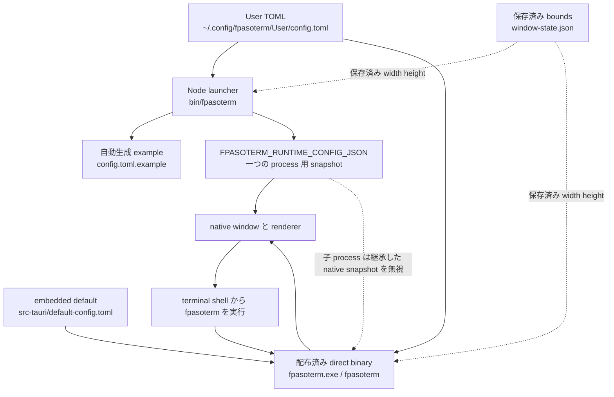

# fpasoterm 設定

fpasoterm はユーザー編集用の設定を以下から読み込みます。

```text
~/.config/fpasoterm/User/config.toml
```

Windows の `~` は現在の user profile を表すため、既定 path は
`%USERPROFILE%\.config\fpasoterm\User\config.toml` です。

起動時に、全デフォルト項目を含む example を以下へ書き出し、古い場合は更新します。

```text
~/.config/fpasoterm/User/config.toml.example
```

`config.toml.example` を `config.toml` にコピーし、変更したい値だけ編集してください。既存の `config.toml` は上書きしません。`config.toml.example` が無い場合や古い場合は、次回起動時に再生成されます。

別の設定ファイルを一度だけ使う場合:

```sh
fpasoterm --config ~/.config/fpasoterm/User/work.toml
fpasoterm -c ~/.config/fpasoterm/User/work.toml
```

window menu の `Help` には、そのwindowが現在使用している設定ファイルの絶対pathを表示します。
`OSC 777;config=...` で runtime config file を適用した場合も、適用後のpathを表示します。

## 変更の反映タイミング

fpasoterm は各 window process の起動時に `config.toml` を読みます。launcher は解決済み設定を
in-memory JSON snapshot として native process へ渡します。これは file cache ではなく、起動済み
window は TOML file の変更を監視しません。編集後は対象 window を閉じて再度起動してください。
`[keybindings]` も同じです。shortcut label と binding は起動時に解決されるため、TOML を編集した
だけでは既存 window に反映されません。



`FPASOTERM_RUNTIME_CONFIG_JSON` はdiskへ保存されず、古いTOML fileのcacheでもありません。
新しい起動ごとに、Node launcherは選択された`config.toml`を読み直して新しいJSON snapshotを作り、
配布済みdirect binaryは選択されたTOMLを自身で読みます。fileが無い場合や古いpartial TOMLの場合も、
current defaultとmergeして読み込みます。`config.toml.example`の更新は別処理であり、既存userの
`config.toml`を変更しません。

設定の読込処理が`config.toml`または`window-state.json`を書き換えることはありません。保存済み
boundsは`window.rememberBounds = true`の場合だけTOMLのwidth/heightより優先され続けます。保存sizeを
削除する操作は明示的な`--reset-window-state`だけです。

window を閉じずに現在の terminal session へ適用する場合は、terminal から次の OSC sequence を
出力します。不明な場合は `Help` に表示される絶対pathを使用してください。

```sh
config_path="$HOME/.config/fpasoterm/User/config.toml"
printf '\033]777;config=%s\a\r\n' "$config_path"
```

PowerShell の場合:

```powershell
$configPath = Join-Path $HOME '.config\fpasoterm\User\config.toml'
[Console]::Write("$([char]27)]777;config=$configPath$([char]7)`r`n")
```

`window.rememberBounds = true` の場合、`window.width` と `window.height` は保存済み
`window-state.json` により追加で上書きされます。`config.toml` で size を試す場合は、
`fpasoterm --reset-window-state` を実行してから新しい window を開いてください。

設定済みウィンドウサイズを一時的に上書きする場合:

```sh
fpasoterm --size 1200x760
fpasoterm -z 1200x760
```

titlebar の表示名や色を一時的に上書きする場合。複数ウィンドウを開いた時の識別に使えます。

```sh
fpasoterm --title work --titlebar-color '#2e7d32'
fpasoterm -t logs -b '#6a1b9a'
```

`--title` を使った場合、shell が送る title change は無視されるため、
ウィンドウ識別用の表示名が維持されます。起動中 terminal から意図して
変更したい場合は `OSC 777;title=...` を使ってください。

起動後に shell でコマンドを実行する場合:

```sh
fpasoterm --command "tmux attach -t work"
fpasoterm -e "tmux attach -t work"
```

一度だけ別の shell を使う場合:

```sh
fpasoterm --shell pwsh.exe
fpasoterm --shell cmd.exe
fpasoterm -s /usr/bin/fish
```

保存済みウィンドウサイズを削除する場合:

```sh
fpasoterm --reset-window-state
```

全設定をOSごとのデフォルトへ戻す場合:

```sh
fpasoterm --reset-config
# 短縮形: fpasoterm -R
```

既存ファイルは同じ場所の `config.toml.backup-<timestamp>` へrenameして残し、
完全な新しい`config.toml`を生成します。保存済み`window-state.json`も削除するため、
次回起動時はデフォルトの幅1000、高さ680が使われます。このコマンドはwindowを
開かず終了します。`--config <path>`と併用した場合は選択したconfigだけをrenameして
resetし、標準のローカルwindow stateも削除します。

既存の値を置き換えず、新しい fpasoterm version で追加された設定項目だけを追加する場合:

```sh
fpasoterm --update-config
```

このcommandは既存の対応済みvalueを維持した完全な正規化済み`config.toml`を書き出し、
書換前に`config.toml.backup-<timestamp>`を作成します。`window-state.json`は変更しません。
`--config <path>`で別fileも更新できます。Node launcherと配布済みdirect binaryの両方で
使用できます。

現在の対応設定schemaに含まれない項目を削除する場合:

```sh
fpasoterm --prune-config
```

こちらもbackupを作成し、対応済みvalueは維持します。ただしthird-party plugin用のcustom key
を含め、unknownな設定を全て削除します。backupを確認できる状態でだけ実行してください。
新しい既定値の追加と削除済み項目の除去の両方が必要な場合は、先に`--prune-config`、次に
`--update-config`を実行します。

解決済み設定と plugin 状態を表示する場合:

```sh
fpasoterm --show-config
```

コマンドラインから plugin を有効化・無効化する場合:

```sh
fpasoterm --enable-plugin hello.ts,theme.ts
fpasoterm --disable-plugin hello.ts,theme.ts
```

plugin 操作は `User/plugins` 配下のファイル名で選択します。複数指定はカンマ区切り、
または同じオプションの繰り返しが使用できます。同名ファイルが複数のサブディレクトリに
ある場合は `group/hello.ts` のように plugins directory からの相対 path を指定します。

## 全デフォルト

```toml
[window]
title = "fpasoterm"
width = 1000
height = 680
minWidth = 420
minHeight = 260
backgroundColor = "rgba(0, 0, 0, 0)"
titlebarColor = "#1565c0"
titleLocked = true
themeSource = "system"
rememberBounds = true
frame = false
[terminal]
allowTransparency = true
cursorBlink = true
cursorStyle = "block"
fontFamily = "\"Noto Sans Mono CJK JP\", \"Noto Sans CJK JP\", \"BIZ UDGothic\", \"Hiragino Sans\", Meiryo, ui-monospace, SFMono-Regular, Menlo, Consolas, monospace"
fontSize = 14
# 省略時の既定値はmacOS Intelで12、その他のOSで14です。
lineHeight = 1.12
minimumContrastRatio = 4.5
rescaleOverlappingGlyphs = true
backgroundOpacity = 0.8
scrollback = 1000
termName = "xterm-256color"
shell = ""

# [terminal.images] は将来の安定した renderer 用に予約されています。
# 現在の build はこの section を無視します。config.toml へ追加しないでください。

[terminal.theme]
background = "rgba(16, 19, 23, 0.80)"
foreground = "#e8edf2"
cursor = "#f5d76e"
selectionBackground = "#35506b"
black = "#11151a"
red = "#ff6b6b"
green = "#8bd17c"
yellow = "#f5d76e"
blue = "#7bb7ff"
magenta = "#d7a8ff"
cyan = "#63d4d5"
white = "#e8edf2"
brightBlack = "#5d6978"
brightRed = "#ff8f8f"
brightGreen = "#ade89f"
brightYellow = "#ffe08a"
brightBlue = "#a4ceff"
brightMagenta = "#e3c3ff"
brightCyan = "#9de9ea"
brightWhite = "#ffffff"

[keybindings]
# Mod は Windows/Linux の Ctrl、macOS の Cmd を表します。
prefix = "Mod+Shift"
# 一文字の value は prefix を継承します。full shortcut はその操作だけ上書きします。
# physical key の例: newWindow = "Ctrl+Alt+KeyN"
logMenu = "L"
logToggle = "S"
logShow = "P"
copy = "C"
paste = "V"
menu = "M"
help = "H"
newWindow = "N"
broadcast = "B"
kill = "K"
tile = "T"
closeAll = "X"

### キー名

`prefix` には `+` 区切りで modifier だけを指定できます。値は `Ctrl` または `Control`、`Alt`
または `Option`、`Shift`、`Meta` または `Cmd` または `Command`、`Mod` です。`Mod` は
Windows/Linux の `Ctrl`、macOS の `Cmd` を表します。modifier の大文字小文字は区別しません。
`Escape` など action key を `prefix` の一部にはできません。

各 action には、`prefix` を継承する action key 一つ、または `Ctrl+Shift+KeyN` のような full
shortcut 一つを指定できます。以下の名前を使用できます。

| 種類 | 名前 | 照合 |
| --- | --- | --- |
| 文字 | `A`-`Z`、`0`-`9`、`-` | browser の key value。keyboard layout 依存 |
| 名前付きキー | `Tab`、`Enter`、`Escape`、`Space`、`Backspace`、`Delete`、`Insert`、`Home`、`End`、`PageUp`、`PageDown` | `Space` と physical form は keyboard code、それ以外は key value |
| function/cursor | `F1`-`F24`、`ArrowUp`、`ArrowDown`、`ArrowLeft`、`ArrowRight` | physical keyboard code |
| physical key | `KeyA`-`KeyZ`、`Digit0`-`Digit9`、`Space`、`Numpad0`-`Numpad9`、`NumpadEnter`、`NumpadAdd`、`NumpadSubtract`、`NumpadMultiply`、`NumpadDivide`、`NumpadDecimal` | physical keyboard code |
| 日本語 IME key | `ZenkakuHankaku`、`KanaMode`、`KanjiMode` | browser の key value。keyboard/OS 依存 |

`Tab`、`Escape`、`Delete`、`Backspace` は使用可能です。例えば `kill = "Escape"` は設定済み
prefix を継承し、`help = "Ctrl+Shift+F1"` は Help だけ full shortcut になります。`Space` は
literal の `Space` で指定できます。例: `broadcast = "Space"`。通常のキーは keyboard layout
に依存しない `KeyN`、`Digit1` を推奨します。

`Fn` は action / modifier として使用できません。通常は keyboard firmware が処理し、browser に
独立した key event が届かないためです。`Fn+F1` は OS が F1 event として渡す場合だけ `F1` として
指定できます。日本語 IME key は IME または OS が先に捕捉する場合があるため、application action
には推奨しません。同様に `Alt+Tab`、`Ctrl+Alt+Tab`、一部の function key のような OS 予約済み
shortcut は fpasoterm に届かないことがあります。同じ full shortcut を複数の fpasoterm action へ
割り当てないでください。

`Ctrl+X` 単体は、例えば `closeAll = "Ctrl+X"` として指定できる有効な full shortcut です。
`Ctrl+X` を押してから `N` を押す形式は、一つのshortcutではなく順序付きkey chordです。現行の
config formatではkey chordには対応していません。

Windows では `Ctrl+N` や `Ctrl+Shift+N` を fpasoterm の確認に使わないでください。WebView または
IME が renderer より先に捕捉する場合があります。代わりに、OS予約と競合しにくい明示的なbindingを
指定します。

```toml
[keybindings]
newWindow = "Ctrl+F2"
```

`--debug-keys --console-diagnostics` で起動すると、動作するshortcutではF2 eventに`ctrl=true`と
`shortcut matched action=newWindow spec=Ctrl+F2`の両方が出ます。`ctrl=false`の場合はOSがmodifierを
渡していないため、renderer側では修正できません。

[ime]
duplicateGuard = true
duplicateWindowMs = 800
repeatedTextWindowMs = 140

[plugins]
enabled = []

[sync]
enabled = false
provider = "folder"
path = ""
channel = "default"
diagnostics = true
maxBytes = 1048576
commands = true
commandTtlSeconds = 60

[logging]
enabled = true
directory = ""
autoStart = false
maxBytes = 10485760
```

## セクション

- `window`: titlebar の表示名、初期ウィンドウサイズ、最小サイズ、背景色、custom titlebar 色、native theme source、frame/titlebar 表示、最後の window bounds を local に記憶するかどうか。`themeSource` は `system`、`light`、`dark` を指定できます。`titleLocked` は既定で `true` で、shell が送る title sequence で fpasoterm の titlebar が上書きされないようにします。`--title` / `-t` と `--titlebar-color` / `-b` は一度だけ titlebar 表示を上書きします。
- `terminal`: terminal 作成時に渡す xterm.js options。macOSでは既定の `fontFamily` を `SF Mono`、`Menlo`、日本語用Hiraginoの順にします。ASCII文字のcell計測を等幅に保つため、可変幅の`Hiragino Sans`をこれらより前へ置かないでください。他OSでは半角カタカナやCJK文字を優先して描画するため、日本語対応フォントを先頭にしています。`minimumContrastRatio` は既定で有効で、暗い terminal background と近すぎる ANSI foreground 色も読めるように補正します。`rescaleOverlappingGlyphs` は CJK glyph の欠けや重なりを抑えるため既定で有効です。`terminal.termName` は既定で `xterm-256color` です。backend PTY も `TERM=xterm-256color` を設定するため、tmux などの terminal multiplexer が terminfo を利用できます。`terminal.shell` は空でなければ platform default shell を上書きします。Windows では `powershell.exe`、`pwsh.exe`、`cmd.exe` などを指定できます。`--shell <command>` / `-s <command>` は一度だけこの設定を上書きします。Windows では PowerShell 7 (`pwsh.exe`) が利用可能な場合に既定 shell として使われます。`pwsh.exe` が `PATH` に無い場合、fpasoterm は `C:\Program Files\PowerShell\7\pwsh.exe` などの一般的な PowerShell 7 install path も確認します。full path も指定できます。`[terminal.images]` は予約済みで、現在の build は値を無視します。追加・有効化しないでください。
- `keybindings`: application shortcut の設定。`prefix = "Mod+Shift"` はWindows/Linuxでは`Ctrl+Shift`、macOSでは`Cmd+Shift`を表します。Windowsでkeyboard layoutまたは他applicationが`Ctrl+Shift`を捕捉する場合は、`prefix = "Ctrl+Alt"`へ変更してください。この変更は共通modifierを置換するため、従来の`Ctrl+Shift` application shortcutは実行されなくなります。prefix tokenは大文字小文字を区別しませんが、`Ctrl`/`Control`、`Alt`/`Option`、`Shift`、`Meta`/`Cmd`/`Command`、`Mod`だけが使用できます。`Ctrl+Esc`は`Esc`がmodifierではなくaction keyのため無効です。無効なprefixは`Mod+Shift`へfallbackし、menuのtooltipで確認できます。一文字のaction valueは`prefix`を継承し、full shortcut はそのactionだけを上書きします。action keyには`Escape`、`F1`、`ArrowUp`、`KeyN`/`Digit1`などを使用できます。例: `newWindow = "Ctrl+Alt+KeyN"`、`kill = "Ctrl+Alt+Escape"`。`KeyN`のような値はphysical keyboard keyで照合するため、keyboard layoutによる`event.key`の違いを避けられます。window menuの先頭には有効なprefixを表示し、各actionはキーだけを表示します。再起動またはruntime config fileの適用でmenu labelとbindingを更新します。
- `ime`: IME composition 向けの二重入力 guard 設定。
- `plugins.enabled`: `~/.config/fpasoterm/User/` からの相対 plugin path。
- `sync`: diagnostics と明示的に送信した broadcast command を同期フォルダで共有する設定。`provider = "folder"` は Google Drive for desktop などで同期済みのローカルフォルダを使います。`commands` は短寿命の共有 command を許可し、`commandTtlSeconds` は実行可能な時間を制限します。詳細は [Sync Folder](sync.ja.md) を参照してください。
- `logging`: terminal output logging 設定。hamburger menu に `Log Start (^S)` / `Log Stop (^S)` と `Log Show (^P)` を表示します。`Ctrl+Shift+L` はlog操作にfocusした状態でmenuを開き、`Ctrl+Shift+S` は記録を直接切り替え、`Ctrl+Shift+P` はcaptured `terminal-*.log` の一覧から表示対象を選択する画面を開きます。制御シーケンスを除去した readable terminal output を local file に記録します。自動生成されるlog名には titlebar の title と timestamp が入り、例は `terminal-work-<timestamp>.log` です。log panel では選択した停止済み log の削除ができ、`Delete All` は log panel 内の確認で承認された場合だけ active log を空にして、設定済み log directory の停止済み `terminal-*.log` を全て削除します。`directory` が空の場合は `~/.config/fpasoterm/User/logs` が使われ、必要に応じて同期フォルダを指定できます。path には `~`、`%USERPROFILE%`、`$HOME` などを使えます。OS 間で共有する設定では `~` が最も扱いやすい指定です。

`window.rememberBounds` が有効な場合、最後の window size は `~/.config/fpasoterm/User/window-state.json` に保存され、次回起動時に復元されます。

window 表示と size は、デフォルト設定、`config.toml` に明示した値、size については保存済み `window-state.json`、最後に `--title`、`--titlebar-color`、`--size` などの一時 CLI 指定、の順に解決されます。size 設定変更を保存済み状態より優先したい場合は、`fpasoterm --reset-window-state` を実行してください。

Windowsでは、起動したterminal processの`Path`先頭にfpasoterm executable directoryを追加します。macOSでは、以前のreleaseでも使用していた標準的な`~/.local/bin/fpasoterm`を現在起動中のapp bundle向けに毎回生成し、`~/.local/bin`を`PATH`先頭に置いて全引数を変更せず転送します。互換性のため`~/.config/fpasoterm/bin/fpasoterm`も更新します。これにより従来のcommand pathを維持したまま、fpasoterm内で`fpasoterm --help`、`--list`、`--close`など直接binaryのcommandを実行できます。macOSで新しいGUIを起動する場合は既定でprocessを切り離して現在のpromptを解放します。終了まで待つ場合は`--foreground`を使います。Node launcher専用option、`--hoge`や`-?`などの未知option、値不足のoptionを配布binaryへ指定した場合は、無関係なGUIを開かずhelp付きerrorにします。`--version` と app内の `Help (^H)` panelにはpackage versionとbuild commitを表示するため、同じversionのcontributor buildやPR buildも識別できます。

macOSは最後のwindowを閉じてもapplicationをactiveのまま維持するのが通常動作です。CLIの`--close` / `-q`とapp内のClose Allでは一致する各fpasoterm processを明示終了するため、`fpasoterm -q all`後はmacOSのメニューバーにもfpasotermを残しません。

起動中の titlebar は terminal 内の command からも変更できます。標準の OSC title sequence は window title を変更し、fpasoterm 独自の OSC 777 は titlebar 表示を変更します。

## Terminal Graphics

Kitty Graphics Protocol、SIXEL、iTerm inline imageは、現在のbuildでは未対応です。xterm.js image addonはChromeOSの現行Tauri/WebKitGTKでWebViewを無反応にすることがあるため、`config.toml`に`[terminal.images]`があっても意図的にloadしません。

graphicsの検証目的でも、fpasoterm内で`kitten icat`、`chafa --format kitty`、`chafa --format sixels`を実行しないでください。fpasotermは`TERM=xterm-256color`を維持し、Kitty graphics capability queryへ応答しないため、`kitten icat`はgraphics非対応のerrorを表示します。これは想定どおりであり、以前再現したrenderer freezeを避けるためです。

## Broadcast Input

hamburger menu の `Broadcast (^B)`、または `Ctrl+Shift+B` を押します。title と PID ごとに一つ以上の local window を選択し、command を入力して `Send` を選ぶと、fpasoterm が改行を正規化して Enter を追加し、選択した local fpasoterm window だけへ送ります。関係のない window を操作せず、複数 terminal で同じ tmux、herdr、diagnostic command を実行できます。

全 local window を選択し、sync が有効な場合、dialog に `Include synced channel` が表示されます。これを選ぶと、同じ sync path と channel を使う、すでに起動している全ての fpasoterm instance にも同じ短寿命 command を送ります。remote window の identity は共有していないため、local の一部だけを選択している場合は sync delivery を無効にします。command file は `sync.commandTtlSeconds`（既定 60 秒）で期限切れとなり、instance は自分の起動前に作成された command を実行しません。

この機能は remote server、OAuth token、後から起動した instance での command 自動実行を使用しません。この機能を使う場合、shared sync folder は command channel になります。参加する全 machine で信頼できる folder と channel だけを使用してください。

次の `printf` 例は POSIX shell (`bash`、`dash`、`fish` など) 向けです。Windows の PowerShell や cmd.exe ではそのまま使えません。

```sh
printf '\033]0;work\a\r\n'
printf '\033]777;titlebarColor=#2e7d32\a\r\n'
printf '\033]777;opacity=0.65\a\r\n'
printf '\033]777;title=work;titlebarColor=#2e7d32\a\r\n'
printf '\033]777;log=start\a\r\n'
printf '\033]777;log=stop\a\r\n'
```

PowerShell で直接送る場合:

```powershell
[Console]::Write("$([char]27)]777;title=work;titlebarColor=#2e7d32$([char]7)`r`n")
```

runtime config sample は次で適用できます。

```sh
./examples/apply-runtime-appearance.sh
```

Windows PowerShell または cmd.exe では次を使えます。

```powershell
.\examples\apply-runtime-appearance.ps1
.\examples\apply-runtime-appearance.bat
```

この sample は title を `RUNTIME SAMPLE ACTIVE` にし、titlebar をピンク、terminal 背景と文字色を分かりやすく変更します。

起動中の window を標準の見た目へ戻す場合:

```sh
./examples/apply-default-appearance.sh
```

Windows PowerShell または cmd.exe では次を使えます。

```powershell
.\examples\apply-default-appearance.ps1
.\examples\apply-default-appearance.bat
```

path を手動指定する場合:

```sh
config_path="$(pwd)/examples/config/runtime-appearance.toml"
printf '\033]777;config=%s\a\r\n' "$config_path"
```

Windows PowerShell で path を手動指定する場合:

```powershell
$configPath = Resolve-Path .\examples\config\runtime-appearance.toml
[Console]::Write("$([char]27)]777;config=$configPath$([char]7)`r`n")
```

runtime config 適用では、現在の shell session は維持されます。`window.title`、`window.titlebarColor`、`window.width`、`window.height`、`terminal.fontSize`、`terminal.lineHeight`、`terminal.minimumContrastRatio`、`terminal.fontFamily`、`terminal.backgroundOpacity`、`terminal.theme` など、起動中に反映可能な表示設定を適用します。`terminal.shell` のように新しい PTY が必要な設定は次回起動時に反映されます。

TOML では同じ table を複数回定義できません。`frame = true` などを試す場合は、既存の `[window]` section 内の値を編集してください。ファイル末尾へ新しく `[window]` を追加すると config parse error になります。

## Plugins

Plugin は以下に配置します。

```text
~/.config/fpasoterm/User/plugins/
```

`config.toml` で有効化します。

```toml
[plugins]
enabled = ["plugins/example.ts"]
```

TypeScript plugin は以下へ変換されます。

```text
~/.config/fpasoterm/User/cache/plugins/
```

設定サンプルは `examples/config/`、plugin sample は `examples/plugins/` を参照してください。
